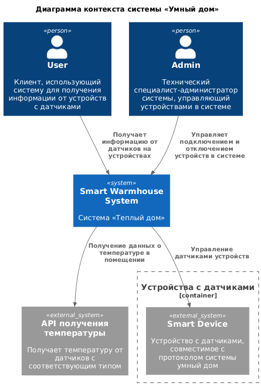
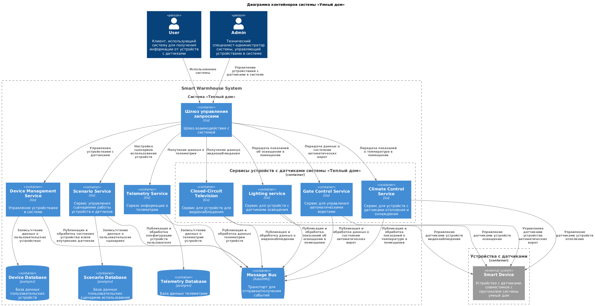
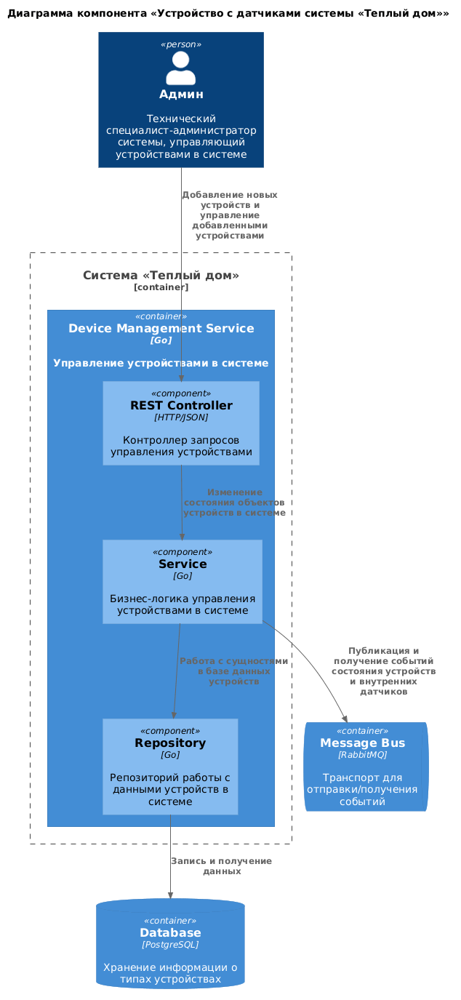
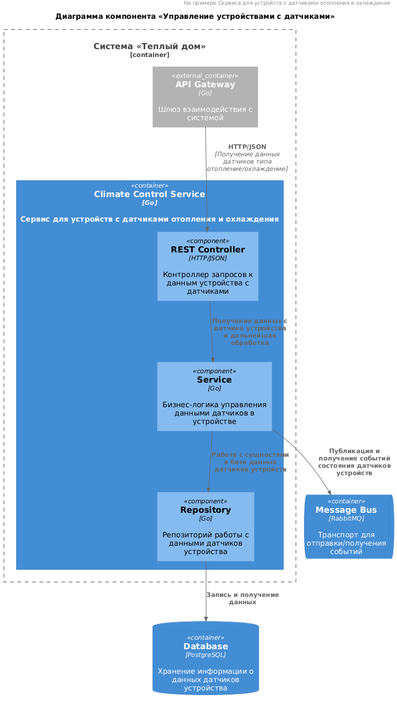
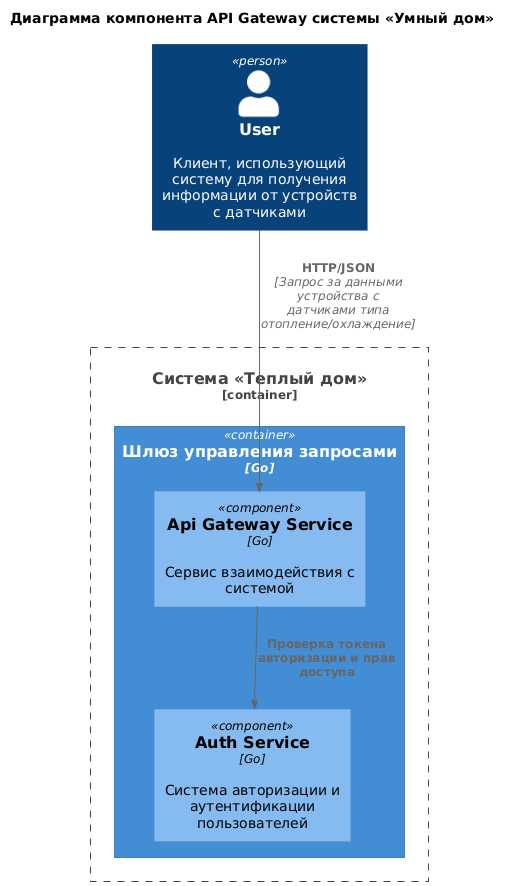
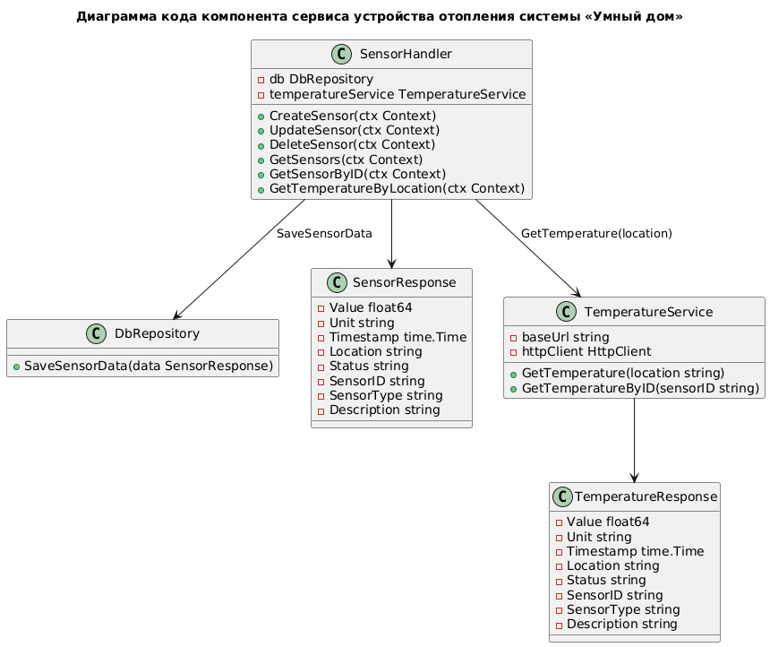
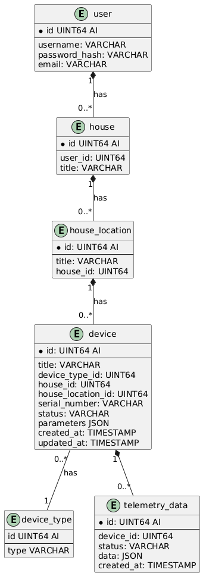

# Project_template

Это шаблон для решения проектной работы. Структура этого файла повторяет структуру заданий. Заполняйте его по мере работы над решением.

# Задание 1. Анализ и планирование

### 1. Описание функциональности монолитного приложения

**Управление отоплением:**

- Пользователи могут удаленно включать и выключать отопление в своих домах
- Система поддерживает:
  - добавление новых устройств с датчиками в помещения
  - получение данных о температуре в помещениях домов, где установлены устройства с температурными датчикам

**Мониторинг температуры:**

- Пользователи могут получать информацию о температуре устройства, расположенного в помещении дома
- Система поддерживает получение данных о температуре с датчиков, установленных в помещении

### 2. Анализ архитектуры монолитного приложения

- **Язык программирования:** Go
- **База данных:** PostgreSQL
- **Архитектура:** Монолитная, все компоненты системы (обработка запросов, бизнес-логика, работа с данными) находятся в рамках одного приложения.
- **Взаимодействие:** Синхронное, последовательная обработка запросов.
- **Масштабируемость**: Ограничена — масштабирование по частям невозможно
- **Развертывание:** Требует остановки всего приложения.

### 3. Определение доменов и границы контекстов

* Домен: мониторинг температуры
  * поддомен мониторинга температуры:
    * контекст: получение температуры от датчика с соответствующим типом в помещении

* Домен: управление датчиками
    * поддомен управления датчиками:
        * контекст: добавление, редактирование и удаление датчиков в помещении
        * контекст: изменение состояния устройств с датчиками в помещении

### **4. Проблемы монолитного решения**

- Отсутствие возможности масштабирования системы по частям
- Отказ одного узла системы (внутреннего сервиса) напрямую влияет на остальные узлы
- Внесение изменений требует рекомпиляции и деплоя всего приложения
- Сильная связность компонентов системы размывает их границы ответственности: внесение изменений в один компонент влечет за собой внесение изменений в другие
- Текущее решение не позволяет управлять сценариями поведения датчиков в помещениях

### 5. Визуализация контекста системы — диаграмма С4



# Задание 2. Проектирование микросервисной архитектуры

В этом задании вам нужно предоставить только диаграммы в модели C4. Мы не просим вас отдельно описывать получившиеся микросервисы и то, как вы определили взаимодействия между компонентами To-Be системы. Если вы правильно подготовите диаграммы C4, они и так это покажут.

**Диаграмма контейнеров (Containers)**



**Диаграмма компонентов (Components)**







**Диаграмма кода (Code)**



# Задание 3. Разработка ER-диаграммы



# Задание 4. Создание и документирование API

### 1. Тип API

Для синхронного взаимодействия микросервисов используется REST API. Его основные преимущества:

- использование стандартных HTTP-методов и формата данных JSON, которые легки в понимании и разработке
- независимость от языков разработки микросервисов
- отсутствие состояния клиента между запросами
- удобство интеграции
- кэширование ответов на сервере для ускорения запросов благодаря HTTP-кэшированию
- легкость тестирования

Помимо этого, микросервисы взаимодействуют друг с другом асинхронно через шину сообщений. Так же,
асинхронно осуществляется передача телеметрии.

### 2. Документация API

#### Синхронное взаимодействие

Локальная генерация API

```shell
make swagger-generate
```

Исходная схема Open API: `docs/api/api.yaml`

#### Асинхронное взаимодействие:

Исходная схема AsyncAPI: `docs/api/asyncapi.yaml`

# Задание 5. Работа с docker и docker-compose

Перейдите в apps.

Там находится приложение-монолит для работы с датчиками температуры. В README.md описано как запустить решение.

Вам нужно:

1) сделать простое приложение temperature-api на любом удобном для вас языке программирования, которое при запросе /temperature?location= будет отдавать рандомное значение температуры.

Locations - название комнаты, sensorId - идентификатор названия комнаты

```
	// If no location is provided, use a default based on sensor ID
	if location == "" {
		switch sensorID {
		case "1":
			location = "Living Room"
		case "2":
			location = "Bedroom"
		case "3":
			location = "Kitchen"
		default:
			location = "Unknown"
		}
	}

	// If no sensor ID is provided, generate one based on location
	if sensorID == "" {
		switch location {
		case "Living Room":
			sensorID = "1"
		case "Bedroom":
			sensorID = "2"
		case "Kitchen":
			sensorID = "3"
		default:
			sensorID = "0"
		}
	}
```

2) Приложение следует упаковать в Docker и добавить в docker-compose. Порт по умолчанию должен быть 8081

3) Кроме того для smart_home приложения требуется база данных - добавьте в docker-compose файл настройки для запуска postgres с указанием скрипта инициализации ./smart_home/init.sql

Для проверки можно использовать Postman коллекцию smarthome-api.postman_collection.json и вызвать:

- Create Sensor
- Get All Sensors

Должно при каждом вызове отображаться разное значение температуры

Ревьюер будет проверять точно так же.


